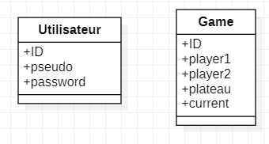

# SIAM - README

Pierre-Louis Bouchez

***
#### Choix techniques :

- Utilisation du framework bootstrap
- Utilisation de Session et de cookie pour l'authentification en plus de la bdd SQLite
- Vérification des déplacement des pions en back pour éviter la triche.

***
#### Architecture :
- Front : Gestion des click et du visuelle via JQuery
          Gestion du jeu via formulaire php
- Back  : Gestion du plateau en Orienté objet
- BDD   : SQLite3

***
#### Diagramme de la base de données :
